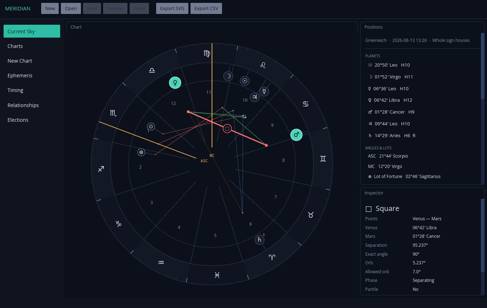
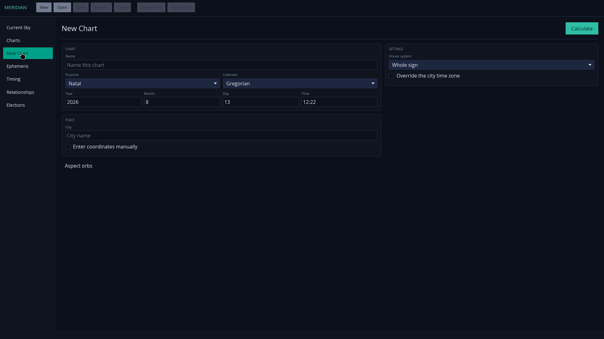
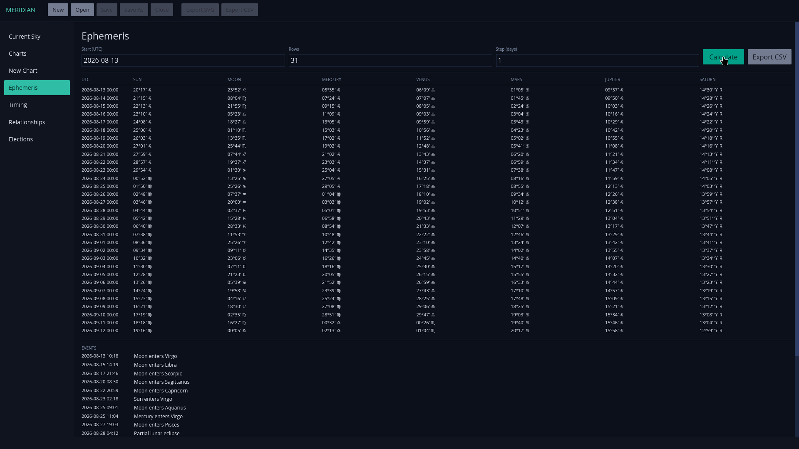

# Meridian

<p align="center">
  
</p>

Meridian is a native desktop application for traditional astrology. It
calculates charts with the Sun, Moon, Mercury, Venus, Mars, Jupiter, and Saturn
using local Swiss Ephemeris data. It has no browser interface, account, remote
service, or network requirement.



## Screenshots

Create a chart from a local date, time, and place:



Calculate a planetary ephemeris and ingress list without a network connection:



## Install

Download the package for your computer from the
[latest release](https://github.com/blackopsrepl/meridian/releases/latest):

- **Fedora, RHEL, openSUSE:** install the `.rpm` package.
- **Debian, Ubuntu, Linux Mint:** install the `.deb` package.
- **Other Linux distributions:** download the `.AppImage`, make it executable,
  and open it. No installation is required.
- **Windows:** run the setup `.exe`. If the release is not Authenticode-signed,
  Windows displays an **Unknown publisher** confirmation before installation.
- **macOS:** open the universal `.dmg` and drag Meridian to Applications. The
  build is ad-hoc signed and does not require an Apple Developer account. On
  first launch, macOS requires **System Settings → Privacy & Security → Open
  Anyway**. This approval is remembered for later launches.

The installers contain the complete ephemeris and city atlas. Chart
calculation, city search, the archive, timing techniques, and exports continue
to work with the computer offline.

## Using Meridian

The left side of the window selects a workspace:

- **Current Sky** shows the current chart for Greenwich in UTC.
- **Charts** opens the local chart archive. Open or delete any archived chart
  from this list.
- **New Chart** calculates a natal, event, horary, mundane, or electional chart
  from a local civil time and place. City search uses the bundled atlas; manual
  coordinates and time zones remain available.
- **Ephemeris** produces a dated planetary table, an event list, or a CSV file.
- **Timing** calculates transits, secondary progressions, solar arc directions,
  harmonics, profections, firdaria, returns, and planetary hours for the open
  chart.
- **Relationships** compares two chart files by synastry, midpoint composite,
  or Davison method and can export the result as SVG.
- **Elections** searches a bounded time range and ranks candidate charts by
  their traditional testimonies.

The chart wheel resizes with the window and with its pane dividers. Select a
planet, aspect, sign, house, angle, Fortune, or Spirit on the wheel or in the
positions list to highlight every connected element and show its exact data in
the Inspector. The Midheaven remains fixed at 12 o'clock, the Ascendant appears
on the left, and zodiacal longitude increases anti-clockwise.

## Charts and files

Newly calculated charts are added to the SQLite archive automatically. The
archive is private to the local user account and remains in place when Meridian
is upgraded.

Use **Save As** when a chart should also exist as a portable `.meridian` file.
Those files can be opened from Meridian's **Open** command or from the operating
system's file manager. SVG and CSV are separate export formats; they do not
replace the editable chart document.

The archive is stored at:

- Linux: `$XDG_DATA_HOME/meridian/meridian.sqlite3`, or
  `~/.local/share/meridian/meridian.sqlite3` when `XDG_DATA_HOME` is unset
- Windows: `%LOCALAPPDATA%\Meridian\meridian.sqlite3`
- macOS: `~/Library/Application Support/Meridian/meridian.sqlite3`

## Calculation scope

Meridian provides tropical apparent geocentric positions, Whole Sign, Equal,
Porphyry, Alcabitius, Placidus, Regiomontanus, Campanus, and Morinus houses,
the five Ptolemaic aspects with configurable orbs, essential and accidental
dignity, reception, sect, lots, antiscia, dodecatemoria, planetary days and
hours, and traditional time-lord techniques.

High-precision calculation requires the pinned Swiss coefficient files.
Meridian reports missing data as an error; it does not silently substitute an
analytical ephemeris or call a remote astrology service. Civil times use IANA
historical time-zone rules, ambiguous times require an explicit fold, and
nonexistent local times are rejected.

[`docs/PARITY.md`](docs/PARITY.md) lists the exact calculation and workflow
scope. [`docs/DOCTRINE.md`](docs/DOCTRINE.md) records the traditional methods
used by the calculation layer.

## Build from source

Development requires Rust 1.95, `curl`, `unzip`, and `sha256sum`. On Linux,
install the development packages for Wayland, XKB, D-Bus, and udev before
building.

```sh
make setup
make run
```

`make setup` downloads the complete long-range coefficient set and GeoNames
atlas, verifies them, and builds the application. For a smaller present-day
development data set covering 1800–2399, run `make data-current` followed by
`cargo build --locked`.

Use `MERIDIAN_DATABASE`, `MERIDIAN_EPHE_PATH`, or `MERIDIAN_CITY_PATH` to
override the archive or resource paths during development. Run the complete
quality gate with `make check`.

Release packaging uses `cargo-packager` 0.11.8 on all three operating systems
and nFPM 2.47.0 for both DEB and RPM. With those tools installed, `make bundle`
builds the packages for the current operating system after verifying the full
offline data set. [`docs/DISTRIBUTION.md`](docs/DISTRIBUTION.md) contains the
release contract.

## Command line

The included `meridian-cli` binary calculates from a JSON request without
starting the desktop application:

```sh
cargo run --locked --bin meridian-cli -- examples/chart-request.json --format json
cargo run --locked --bin meridian-cli -- examples/chart-request.json --format svg --output chart.svg
cargo run --locked --bin meridian-cli -- examples/chart-request.json --format csv --output chart.csv
```

All three formats use the same immutable calculated chart.

## License

Meridian is AGPL-3.0-or-later because the default calculation engine is a
derivative of Swiss Ephemeris. Proprietary distribution requires the
appropriate Swiss Ephemeris Professional License and a compatible licensing
choice for the provider.
